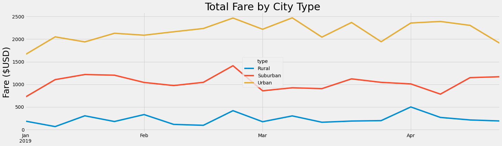

# PyBer Analysis

## Overview of the analysis

I have recently joined as data analyst at PyBer, a ride-sharing app company, and was assigned my first big project. I and my manager, Omar, had to analyze all the ridesharing data from January to early May of 2019 and present the findings in compelling visualizations to the CEO, V. Isualize. 

V. Isualize has given us a new assignment which includes creating following using Pandas and Matplotlib:
1. Summary DataFrame of ride-sharing data by city type.
2. Multiple-line graph which shows total weekly fares for each city type.
3. A written report that summarize how results differ with each city type and how these can be used for decision-making at PyBer. 

Resources: ride_data.csv, city_data.csv

## Results

### Summary DataFrame:

 

### Multiple-line Graph for 2019-01-01 to 2019-04-29:

### Multiple-line Graph for 2019-01-01 to 2019-04-28:

### Observations:

* Urban cities have highest number of **Total Rides** (1,625) for given time period, which is 2.6 times the rides for Suburban (625) and  13 times those of Rural (125) cities.
* Urban cities also have highest number of **Total Drivers** at 2,405. This is 4.9 times the drivers in Suburban cities (490), and around 30.8 times the drivers in Rural cities (78).
* Highest **Total Fare** was collected in Urban cities with a total fare collection of $39,854.38. Suburban cities hold second position with $19,356.33 (around 50% of Urban). Rural cities hold third position with $4,327.93 (around 9.2% of Urban).
* Rural cities have highest **Average Fare per Ride** at $34.62, followed by Suburban cities with $30.97. Urban cities have lowest Average Fare per Ride at $24.53. It means a ride in a Rural city can earn 41.1% more than a ride in Urban city and 11.8% more than a ride in Suburban city on an average. 
* Rural cities have highest **Average Fare per Driver** at $55.49. Suburban cities come at second position with $39.50. Urban cities have lowest Average Fare per Drive at $16.57. Therefore, a driver in Rural cities earns an average fare which is 3.3 times more than Urban and 1.4 more than Suburban cities. 
* The week ending *Feb 24th was best in terms fares collected* across all city types. Urban and Suburban cities earned highest total fares that week with total of $2,466.29 and $1,412.74 respectively. Rural cities had second highest fares with a total of $419.06. The combined fare from all city types was $4,298 during this 
* The first week of January had lowest fares for Urban ($1,661.68) and Suburban ($721.60) city types, and *lowest overall fares* collected ($2,571.2) across all city types despite considering the fact that it has six days.
* For Rural cities, the lowest amount of fares was collected in second week of January and highest in first week of April.

## Summary:

Based on the observations mentioned above, given below are three recommendations:

1. Since Rural cities have very low number of Total Drivers as compared to Urban cities, it is recommended to take certain steps that will lead to *increase the number of drivers in rural cities.* Also, since Rural cities also have highest Average Fare per Driver, this can also lead to significant increase in the revenue and profits. Similarly, we can also increase the number of drivers in Suburban cities as the number of drivers are lower than Urban cities but Average Fare per Driver is higher than Urban.
2. The number of Total Rides in Rural cities is less than a tenth of those in Urban cities. Though marketing the PyBer app in those rural cities more aggressively is recommended, we may not be able to scale up the demand beyond a certain level due to the limited population. *Therefore, it is recommended to expand usage of PyBer app in more rural cities.* This would also be more profitable because Rural cities have highest Average Fare per Ride. Similarly, we can introduce app in some more Suburban cities.
3. Urban cities have lowest Average Fare per Ride and Average Fare per Driver. Therefore it is recommended:
    
    * Market the app as an alternative for long distance commute in Urban cities so that more and more people take longer rides which will results in higher Average Fare per Ride.
    * Device a mechanism which will provide each Urban driver a minimum number of long distance rides which will increase their Average Fare per Driver. This can also encourage more drivers to join PyBer ride sharing app. 
