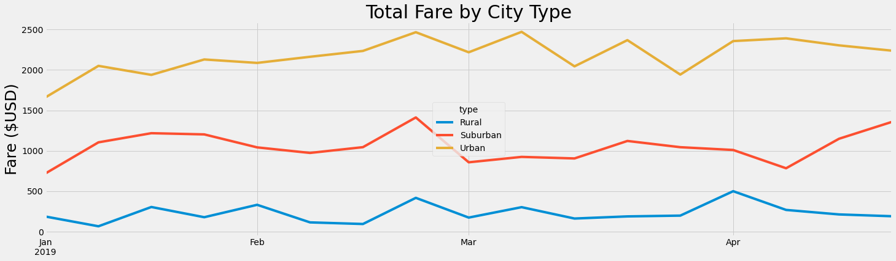

# PyBer_Analysis

## Overview of the analysis

I have recently as joined data analyst at PyBer, a ride-sharing app company, and was assigned my first big project. Me and my manager, Omar, had to analyze all the ridesharing data from January to early May of 2019 and present the findings in compelling visualizations to the CEO, V. Isulaize. 

V. Isualize has given us a new assignment which includes creating following using Pandas and Matplotlib:
1. Summary DataFrame of ride-sharing data by city type.
2. Multiple-line graph which shows total weekly fares for each city type.
3. A written report that summarize how results differ with each city type and how these can be used for decision-making at PyBer. 

## Results

### Summary DataFrame:

 

### Multiple-line Graph:

### Description:

1. Urban cities have highest number of **Total Rides** (1625) for given time period, which is 2.5 times the rides for Suburban (625) and  13 times those of Rural (125) cities.
2. Urban cities also have higest number of **Total Drivers** at 2405. This is 4.9 times the drivers in Suburban cities (490), and around 30 times the drivers in Rural cities (78).
3. Highest **Total Fares** was collected by Urban city types with a fare collection of $39,854.38. Suburban cities hold second position with $19,356.33 (around 50% of Urban). Rural cities hold third position with $4,327.93 (around 11% of Urban).
4. Rural cities have highest **Average Fare per Ride** at $34.62, followed by Suburban cities with $30.97. Urban cities have lowest Average Fare per Ride at $24.53.
5. Rural cities have highest **Average Fare per Drive** at $55.49. Suburban cities comes at second position with $39.50. Urban cities have lowest Average Fare per Drive at $16.57.
6. 